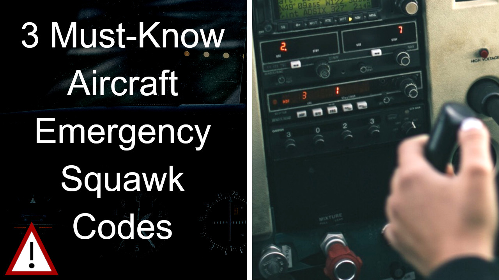

# What is a Squawk in Aviation?

What says “squawk” and flies in the sky? Is it a parrot, a Cessna, or a 787? Or all three? Squawk is a common term used in air traffic control to describe a specific type of radio signal that comes from the plane’s transponder. So this funny word is not just for the birds–pilots of all types of planes get to squawk, too.

# What is a Transponder? How does it Work?

A transponder is a radio in your avionics stack, but it isn’t used for voice communications. Instead, it creates a signal that only air traffic control (ATC) radar systems can see. 

The primary purpose of a transponder is to help controllers pick apart all the targets on their radar scopes. When the radar sweeps the sky, radio waves bounce off the aircraft and return to the station. Those returns on the scope show that there’s a plane there, but it can’t tell much about it.

This basic radar blip is called a “primary return.” If the controller watches the primary return they can get an idea of speed and direction. But it gives no indication of the target’s altitude. Plus, all primary returns look the same, so there’s no way to tell which return belongs to which plane, beyond its location on a map. 

The transponder fixes all of these problems. First, the transponder sends a signal to the radar that contains a four-digit squawk code. For example, if the air traffic controller tells one plane to “Squawk 1234,” that number will appear on the radar scope. This more detailed target is called a “secondary return.”

What’s more, modern transponders have “Mode-C.” A Mode-C transponder has the ability to send out the plane’s pressure altitude. The controller calibrates their scope with the current altimeter setting, and all aircraft then show their altitudes. With that information, the controller can separate flights safely in three dimensions. 

# History of the Transponder and the Word “Squawk”

If you think the word squawk sounds like a bird squawking, you’ve got a good idea of how the transponder came to be. 

Today’s transponder technology was first designed in World War II when radar was first implemented. Controllers needed a way to identify friend or foe (IFF), so a basic transponder was developed. If the radar hit a plane and it returned a friendly transponder code, it was a friend. If it returned a primary only–or something else–it was treated as a foe. The codename for the IFF system was “Parrot,” and the signals the planes sent out became known as squawks.

# Transponder Squawk Codes You Should Know

There are a handful of four-digit codes that every pilot should know. These are used every day in the National Airspace System. Never forget your transponder can communicate with ATC even when you think you can’t.

0000 — A generic code that is not assigned and should not be used.

1200 — VFR aircraft. The default code for all flights–if you aren’t asked to set anything else, you should set 1200.

7500 — Hijacking

7600 — Voice radio failure

7700 — Mayday or emergency

# PYTHON SCRIPT
The script today call [adsbexchange API](https://www.adsbexchange.com/) and check id there is any airplanes that squawking one of the following code

- CODE 7700 = emergency
- CODE 7600 = communicationfailure
- CODE 7500 = hijacking

in case there is an event the script post a tweet on twitter 


The script use selenium to make screenshot of the webpage https://globe.adsbexchange.com/?icao=ab6162

```
pip install selenium
```

```
def screenshot(url, icao24):
    options = Options()
    options.add_argument('--no-sandbox')
    options.add_argument('--disable-dev-shm-usage')
    options.add_argument('--headless')
    options.headless = True
    options.add_argument('window-size=800,800')
    options.add_argument('ignore-certificate-errors')
    # Plane images issue loading when in headless setting agent fixes.
    options.add_argument(
        "user-agent=Mozilla/5.0 (Windows NT 10.0; Win64; x64) AppleWebKit/537.36 (KHTML, like Gecko) Chrome/101.0.4951.54 Safari/537.36")
    driver = webdriver.Chrome("/usr/lib/chromium-browser/chromedriver", chrome_options=options)
    # driver = webdriver.Chrome(DRIVER)
    driver.get(url)
    screenshot = driver.save_screenshot('/images/' + str(icao24) + '.png')
    driver.quit()
 ```

this is the tweeter part
```
pip install tweepy

```

```
def twitter(post):
    # all the keys we need for our twitter bot
    CONSUMER_KEY = '<CONSUMER_KEY>'
    CONSUMER_SECRET = '<CONSUMER_SECRET>'
    ACCESS_KEY = '<ACCESS_KEY>'
    ACCESS_SECRET = '<ACCESS_SECRET>'
    # talk to twitter
    auth = tweepy.OAuthHandler(CONSUMER_KEY, CONSUMER_SECRET)
    auth.set_access_token(ACCESS_KEY, ACCESS_SECRET)
    api = tweepy.API(auth)
    api.update_status(post)
```
